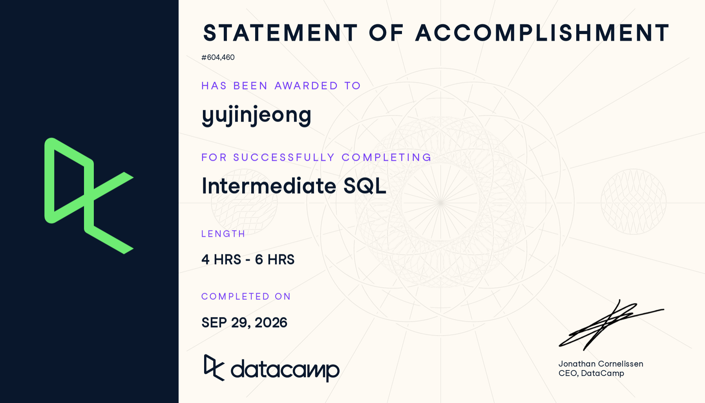

## 1. Course-Completion Evidence



I successfully completed the "Intermediate SQL" course on DataCamp on September 29, 2026. This course expanded my knowledge of complex SQL queries, including conditional logic, subqueries, and window functions.

## 2. Learning Notes and Key Takeaways

### Chapter 1: Conditional Logic with CASE
1. **Main ideas:** The `CASE` statement allows us to write conditional logic directly within a SQL query, functioning similarly to an IF-THEN-ELSE statement in other programming languages. It evaluates conditions and assigns new values accordingly.
2. **Important SQL syntax:** `CASE WHEN [condition] THEN [result] ELSE [default_result] END`
3. **When to use it:** This is incredibly useful for categorizing or binning data into new distinct groups without altering the underlying database.
4. **SQL example:**
   ```sql
   SELECT 
     respondent_id,
     nps_score,
     CASE 
       WHEN nps_score >= 9 THEN 'Promoter'
       WHEN nps_score >= 7 THEN 'Passive'
       ELSE 'Detractor' 
     END AS customer_segment
   FROM customer_surveys;
   ```
5. Explanation: This query reads the Net Promoter Score (nps_score) for each survey respondent and creates a new column called customer_segment. It classifies scores of 9-10 as 'Promoter', 7-8 as 'Passive', and everything else as 'Detractor'.

6. CEP application: Since the Avenue Shabu project relies heavily on customer feedback and surveys rather than paid ad tracking, we can use CASE statements to segment our survey respondents based on their satisfaction levels or dining frequency, allowing us to analyze the demographic profiles of our most loyal customers.

### Chapter 2: Subqueries and CTEs (Common Table Expressions)
1. Main ideas: Subqueries and CTEs allow us to break down complex queries by querying against the results of another query. CTEs make the code more readable by defining a temporary dataset at the beginning of the query.

2. Important SQL syntax: WITH cte_name AS (SELECT ...) to define a CTE, followed by the main SELECT statement.

3. When to use it: Use CTEs when you need to perform multiple analytical steps, such as calculating an average first and then finding records that exceed that average.

4. SQL example:
```sql
WITH AverageSatisfaction AS (
  SELECT AVG(overall_rating) AS avg_rating 
  FROM dining_feedback
)
SELECT 
  menu_item, 
  overall_rating
FROM dining_feedback
WHERE overall_rating > (SELECT avg_rating FROM AverageSatisfaction);
```
5. Explanation: The CTE (AverageSatisfaction) first calculates the overall average rating across all feedback. The main query then returns only the menu items that received a rating higher than this calculated average.

6. CEP application: We can apply CTEs to Avenue Shabu’s GA4 website data exported to BigQuery. For example, we can calculate the average organic traffic per day in a CTE, and then filter to see which specific days of the week consistently overperform the baseline average.

### Chapter 3: Window Functions
1. Main ideas: Window functions perform a calculation across a set of table rows that are somehow related to the current row, without collapsing the individual rows into a single output row like a standard GROUP BY would.

2. Important SQL syntax: OVER(PARTITION BY column_name ORDER BY column_name) used alongside functions like RANK(), ROW_NUMBER(), or SUM().

3. When to use it: Excellent for calculating running totals, moving averages, or ranking items within a specific category.

4. SQL example:

```sql
SELECT 
  customer_id, 
  visit_date, 
  ROW_NUMBER() OVER(PARTITION BY customer_id ORDER BY visit_date) as visit_sequence
FROM store_visits;
```

5. Explanation: This assigns a sequential number (visit_sequence) to each visit made by a customer, ordered by the date. The partition ensures the count resets for each unique customer_id.

6. CEP application: This will be very helpful for analyzing returning customers for Avenue Shabu. We can use window functions to identify a customer's first visit versus their subsequent visits, helping us understand the customer retention cycle based on organic interactions.

## 3. Overall Reflection and Series Synthesis
Throughout the Intermediate SQL course, the most useful query patterns were CTEs and CASE statements. They provide immediate, practical ways to clean and categorize data on the fly. The most challenging concepts were Window Functions, as understanding how PARTITION BY behaves compared to a standard GROUP BY required visualizing the data structure differently. I resolved this confusion by running multiple small queries to see how the row numbers changed based on different partition conditions.

This course naturally extended what I learned in Introduction to SQL by moving beyond simple data retrieval and focusing on complex logic and data manipulation. These skills are highly transferable to Google BigQuery, especially because BigQuery handles CTEs and Window Functions very efficiently on large datasets.

For the Avenue Shabu CEP, these intermediate techniques are essential. Because we are not focusing on paid media or complex attribution models like Difference-in-Differences, our analysis hinges on deeply understanding organic traffic (GA4) and survey data. Using CASE to segment survey answers and CTEs to structure GA4 behavior flows will be the core of our analytical strategy. I expect to frequently consult the Window Functions section of this portfolio when calculating time-based metrics or customer visit frequencies in the future.

## 4. Appendix: Publication Links

- [GitHub Repository](https://github.com/jennyjeong53/ibm-6500-sql-learning-portfolio)
- [Published Intermediate SQL Report](https://jennyjeong53.github.io/ibm-6500-sql-learning-portfolio/intermediate-sql.html)
