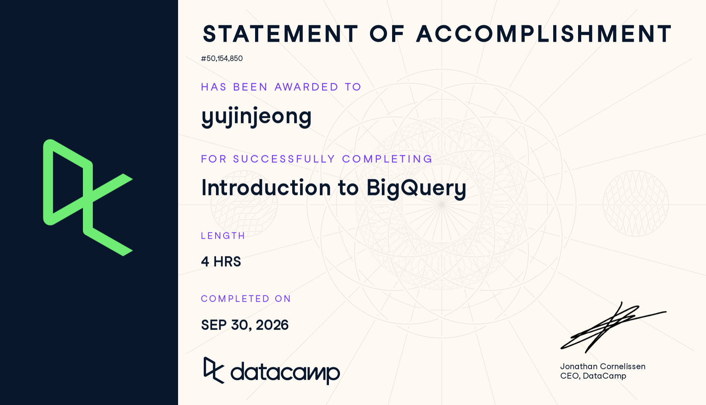

## 1. Course-Completion Evidence



I successfully completed the "Introduction to BigQuery" course on DataCamp on September 30, 2026. This course provided me with a strong foundation in navigating the BigQuery console and writing SQL queries specific to the platform.

## 2. Learning Notes and Key Takeaways

### Chapter 1: Introduction and BigQuery Console

-   **Main ideas:** BigQuery is Google's fully managed, serverless enterprise data warehouse. Unlike traditional databases, it is highly scalable and designed to analyze petabytes of data quickly using Google's infrastructure.

-   **BigQuery terminology or procedures:**

    -   **Project:** The top-level container for datasets.
    -   **Dataset:** A top-level container that holds tables and views.
    -   **Table:** Where the actual data is stored, structured in columns and rows.

-   **Important SQL syntax:** BigQuery uses backticks (`) to enclose the full path of a table (`project_name.dataset_name.table_name\`).

-   **Example:** \`\``sql   SELECT *   FROM`bigquery-public-data.samples.gsod\` LIMIT 10;

-   **Explanation:** This query accesses a public dataset provided by Google BigQuery, specifically the global surface summary of the day (gsod). Using the full project and dataset path is required in BigQuery to locate the exact table.

-   **CEP application:** For the Avenue Shabu project, BigQuery can be the central warehouse to store exported Google Analytics 4 (GA4) data and customer feedback surveys. Understanding how to structure our data into specific datasets (e.g., avenue_shabu_project.website_data) will help keep our analysis organized.

### Chapter 2: Querying and Filtering Data

-   **Main ideas:** Once data is accessible in BigQuery, standard SQL is used to filter, sort, and aggregate it to find meaningful insights.

-   **BigQuery terminology or procedures:** We learned how to use the BigQuery UI to preview schemas before running queries to save data processing costs.

-   **Important SQL syntax:** WHERE for filtering, GROUP BY for aggregation, and ORDER BY for sorting results.

-   **Example:**

``` sql
SELECT 
  year, 
  COUNT(*) as total_records
FROM `bigquery-public-data.samples.natality`
WHERE state = 'CA'
GROUP BY year
ORDER BY year DESC;
```

-   **Explanation:** This query counts the total number of birth records in California per year, grouping the results by year and sorting them from the most recent year to the oldest.

-   **CEP application:** We can use these filtering and grouping techniques to analyze Avenue Shabu's customer demographics or organic social media metrics. For example, grouping customer survey responses by specific dining experiences to identify trends.

### Chapter 3: Advanced BigQuery Functions

-   **Main ideas:** BigQuery offers specific functions to handle complex data types, such as handling date/time and using aggregation functions to summarize large datasets efficiently.

-   **BigQuery terminology or procedures:** Standard SQL vs. Legacy SQL. BigQuery now defaults to Standard SQL, which is compliant with SQL 2011.

-   **Important SQL syntax:** EXTRACT() for dates, COUNT(DISTINCT column_name) to find unique values.

-   **Example:**

``` sql
SELECT 
  EXTRACT(MONTH FROM date) as month,
  COUNT(DISTINCT visitor_id) as unique_visitors
FROM `my_project.ga4_export.events`
GROUP BY month;
```

(Note: my_project.ga4_export.events represents a placeholder for a GA4 data export table).

-   **Explanation:** This extracts just the month from a full date timestamp and counts the unique visitors for that month.

-   **CEP application:** Since our CEP does not involve paid ad tracking, analyzing organic website traffic through GA4 is crucial. Using EXTRACT and COUNT(DISTINCT) in BigQuery will allow me to track unique monthly visitors to the Avenue Shabu website and monitor how organic engagement changes over time.

## 3. Overall Reflection and Future Reference

The most useful concept I learned was how BigQuery organizes data hierarchically (Project \> Dataset \> Table) and how to seamlessly access public datasets to practice SQL. Using BigQuery is quite different from learning standard SQL alone because it requires understanding the cloud environment, managing project paths with backticks, and being mindful of query processing costs (by previewing schemas first). The most challenging part was adapting to the specific syntax for querying nested data, which is common in GA4 exports.

Moving forward, BigQuery will be highly beneficial for digital marketing analytics, especially for our CEP with Avenue Shabu. I expect to frequently review the syntax for date functions and data aggregation (GROUP BY) to summarize customer insights and organic website performance efficiently.

## 4. Appendix: Publication Links

-   [GitHub Repository](https://github.com/jennyjeong53/ibm-6500-sql-learning-portfolio)
-   [Published Introduction to BigQuery Report](https://jennyjeong53.github.io/ibm-6500-sql-learning-portfolio/introduction-to-bigquery.html)
