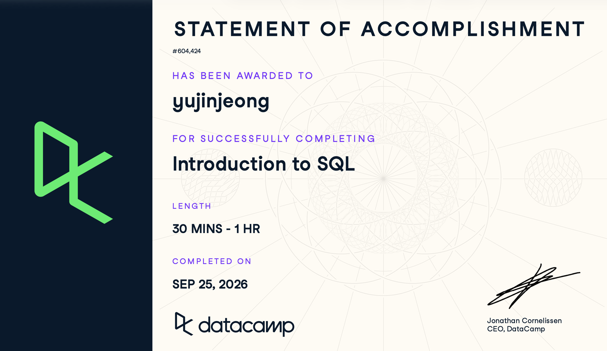

## 1. Course-Completion Evidence

 I successfully completed the Introduction to SQL course on September 25, 2026.

## 2. Learning Notes and Key Takeaways

### Meet Databases & SQL

1.  **Main ideas:** This chapter introduced what a database is and why SQL is the standard language for communicating with relational database management systems. I learned how data is organized into tables with columns and rows.

2.  **Important SQL syntax:** The basic structure of querying data.

3.  **Example:**

``` sql
SELECT *
FROM customers;
```

4.  **Explanation of the example:** This simple query retrieves every column and every row from the customers table, giving a complete view of the dataset.

5.  **CEP application:** Understanding relational databases is the first step in managing Avenue Shabu's raw data. Even if we rely more on organic social data and surveys rather than complex paid ad databases, knowing how data tables are structured helps organize our survey responses effectively.

### Write Your First SQL

1.  **Main ideas:** This section covered how to extract only the specific data we need. Instead of pulling everything, I learned how to select specific columns, limit the number of rows returned, and sort the results to find top or bottom values easily.

2.  **Important SQL syntax:** SELECT, ORDER BY, LIMIT

3.  **Example:**

``` sql
SELECT review_text, rating
FROM survey_responses
ORDER BY rating DESC
LIMIT 5;
```

4.  **Explanation of the example:** This query selects only the review text and rating columns. It sorts the results by rating in descending order (highest first) and limits the output to show only the top 5 highest-rated reviews.

5.  **CEP application:** Since the Avenue Shabu project focuses heavily on organic customer feedback, I can use ORDER BY and LIMIT to quickly identify the most positive or most negative recent survey responses to extract actionable customer insights.

### Complete Your SQL Foundation

1.  **Main ideas:** The final chapter focused on refining queries further. I learned how to identify unique values in a dataset and how to rename columns in the query output to make the results more readable for reporting.

2.  **Important SQL syntax:** DISTINCT, AS (Aliasing)

3.  **Example:**

``` sql
SELECT DISTINCT menu_item AS unique_dishes_ordered
FROM orders;
```

4.  **Explanation of the example:** This query looks at the orders table, finds all the unique items ordered using DISTINCT, and renames the output column to unique_dishes_ordered for better readability.

5.  **CEP application:** Using DISTINCT will be very useful when analyzing Avenue Shabu's data. For instance, if we have a list of organic social media mentions or survey participants, I can easily count the number of unique customers who participated, rather than counting duplicate entries.

## 3. Overall Reflection and Future Reference

-   **Most useful skills:** Learning how to limit and sort data (ORDER BY, LIMIT) was extremely practical. It allows me to immediately find the most relevant information without scrolling through massive tables.

-   **Most challenging concepts:** Understanding the subtle differences between various SQL flavors and database architectures was slightly confusing at first, but the core syntax remains largely the same.

-   **Support for digital marketing/CEP:** SQL provides a structured way to handle raw survey and customer data. For Avenue Shabu, since we lack paid tracking, organizing and querying organic feedback and survey results efficiently will be crucial for building our marketing strategy.

-   **Future review:** I plan to review Aliasing (AS) again, as making column names readable is important when presenting data findings to the client or professor.

## 4. Appendix: Publication Links

- [GitHub Repository](https://github.com/jennyjeong53/ibm-6500-sql-learning-portfolio)
- [Published Introduction to SQL Report](https://jennyjeong53.github.io/ibm-6500-sql-learning-portfolio/introduction-to-sql.html)
